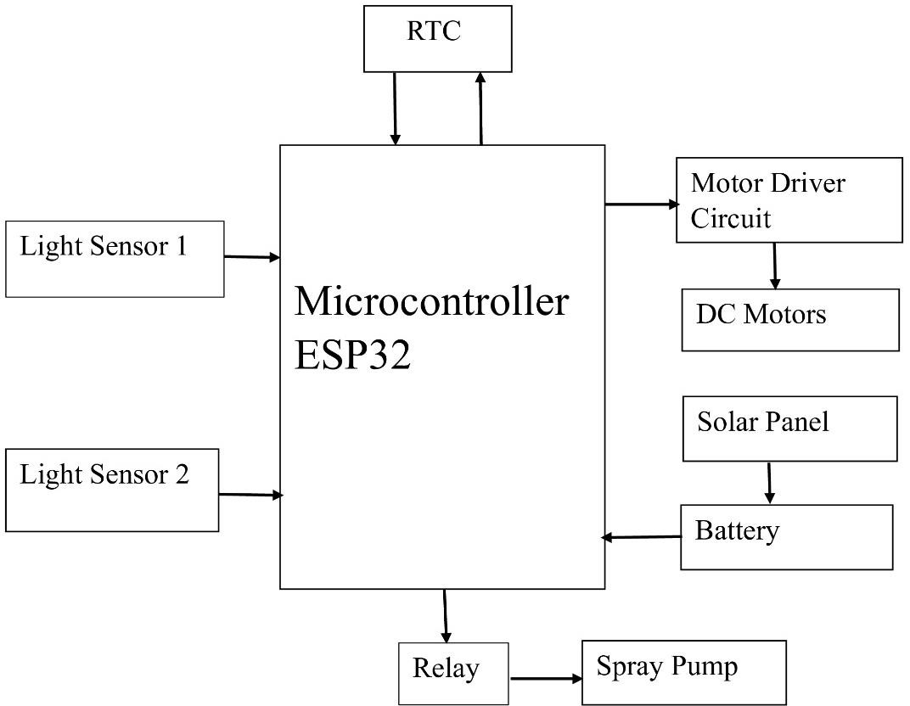
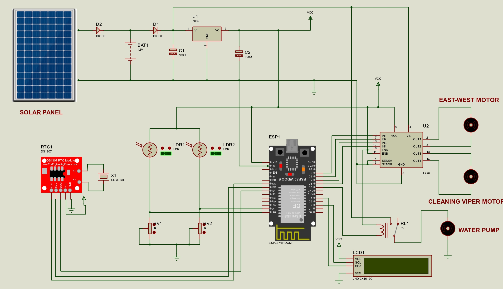
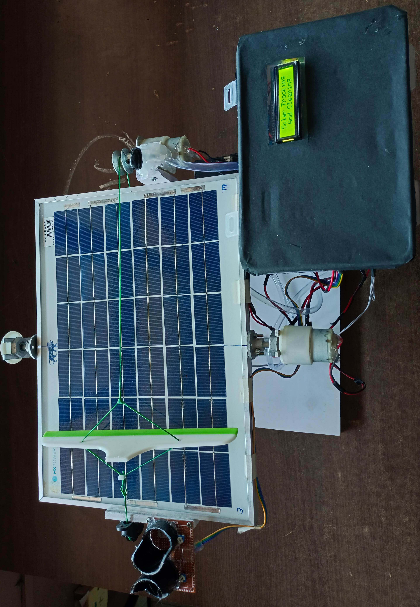

# ☀️ Solar Panel Tracking and Cleaning Mechanism

An automated system that improves solar panel efficiency by combining **sun tracking** and **automated cleaning**. Built using an ESP32 microcontroller, LDR sensors, RTC module, and a water pump, this system ensures **maximum energy generation** and **minimal manual maintenance**.

---

## 📌 Project Overview

Solar panels often lose efficiency due to **dust accumulation** and **fixed positioning**. This project solves both problems by:
- Using **LDR sensors** for sun tracking
- Using an **RTC module** to automate the cleaning process
- Storing the energy in a **12V lead-acid battery** for uninterrupted power supply

---

## 🎯 Objectives

- 🔄 **Automated Sun Tracking** – Real-time panel rotation using LDR sensors
- 💧 **Scheduled Cleaning** – Water pump and brushes activated by RTC
- 🔋 **Energy Storage** – Power stored in a 12V battery for continuous use
- 🧠 **Low Maintenance** – Fully automated system reduces human intervention

---

## 🧠 Key Features

- Single-axis solar tracking system
- RTC-based automatic cleaning mechanism
- Energy storage for night/cloudy weather
- ESP32-controlled automation
- Scalable for IoT upgrades

---

## ⚙️ Hardware Used

| Component          | Specification           |
|--------------------|--------------------------|
| Microcontroller    | ESP32                    |
| Light Sensors      | 2 × LDRs                 |
| Motors             | 2 × DC Motors            |
| Motor Driver       | L298                     |
| RTC Module         | DS1302                   |
| Solar Panel        | 5W                       |
| Battery            | 12V 5Ah Lead-Acid        |
| Relay              | Single-channel           |
| Water Pump         | Mini DC Pump             |
| Display (optional) | 16x2 LCD                 |
| Jumper Wires       | -                        |

---

## 💻 Software Used

- **Arduino IDE**
- **Embedded C**
- **Windows 11**

---

## 🔁 System Workflow

1. ESP32 initializes all sensors and modules.
2. LDR sensors detect sunlight intensity and send data to the microcontroller.
3. Based on the data, DC motors adjust the panel to track sunlight.
4. RTC checks if it’s the scheduled cleaning time.
5. If true, relay triggers water pump and cleaning begins.
6. Battery stores generated energy for backup use.
7. System repeats cycle throughout the day.

---

## 📊 Result & Performance

- 📈 **Efficiency improved** by ~25–30% using tracking.
- 💦 **Cleaning system** prevents energy drop up to 20%.
- 🔋 **Battery storage** supports continuous operation in low-light conditions.

---

## 📽️ Demo Video

🎬 [Watch on YouTube](https://youtu.be/hgodJ8Q-ucY)

---

## 📸 Images

<h3>🔲 Block Diagram</h3>

<h3>🔌 Circuit Diagram</h3>

<h3>📦 Final Model</h3>

---

## 🔮 Future Scope

- 🌐 **IoT Integration** – Monitor panel status and cleaning cycle via mobile app
- 🧭 **Dual-Axis Tracking** – For increased solar exposure accuracy
- 🚿 **Waterless Cleaning** – Using air jets or anti-dust coatings
- 🤖 **Smart Scheduling** – Based on air quality or dust sensors

---

## 💡 Applications

- 🏠 Residential Solar Installations
- 🏭 Commercial Solar Farms
- 🔋 EV Charging Stations
- 🏙️ Smart Cities
- 🌄 Rural Electrification Projects

---
